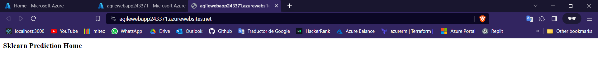
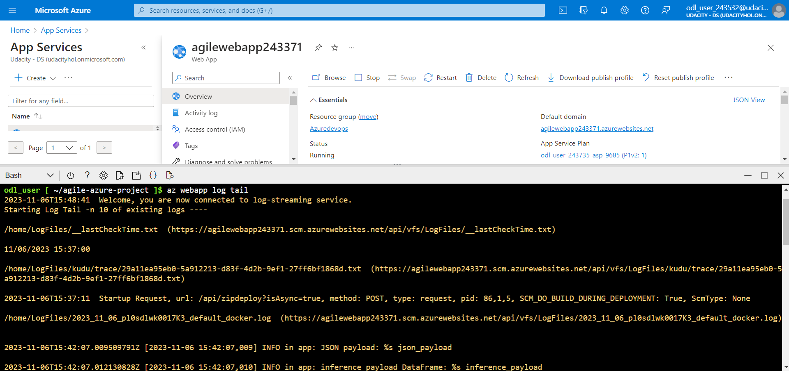
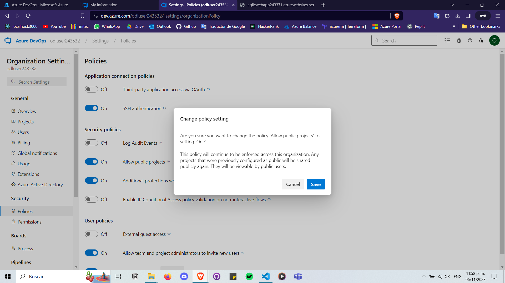

# Overview

The next repo focuses on building a CI/CD pipeline for a Python-based machine learning application using Flask. It involves creating a GitHub repository from scratch and integrating GitHub Actions with Azure Pipelines. The goal is to enable continuous delivery to Azure App Service. The project centers around a pre-trained sklearn model for predicting housing prices in Boston, making API-based predictions. It's an opportunity to operationalize a Flask app and apply CI/CD skills to a machine learning microservice.

## Project Plan

* A link to a Trello board for the project: [Board](https://trello.com/invite/b/iWRuRqZX/ATTI5babe4b322b04a08b098ae33f8fb7fed45CF92BA/ci-cd-prediction-project)


* A link to a spreadsheet that includes the original and final project plan: [Spreadsheet](https://docs.google.com/spreadsheets/d/1pG1R0-GQ0s2-VLHSyHYtCa0ZMqK_8JjP/edit?usp=drive_link&ouid=103843746963254590175&rtpof=true&sd=true)


# Instructions

### Architectural Diagram
Before we start, here is an Architectural Diagram that shows how key parts of the system work


## 1. CI: Set Up Azure Cloud Shell

### 1.1 Create the Cloud-Based Development Environment

* Create a GitHub Repo

* Launch an Azure Cloud Shell Environment and create ssh-keys.
```
    ssh-keygen -t rsa
    cat /home/odl_user/.ssh/id_rsa.pub
```

* Upload these keys to your github account. 


* Clone your repository project (Don't forget to use the ssh option in github when cloning). 


### 1.2 Create Project Scaffolding

Now that your environment is set up, you can create the scaffolding for your project and test your code

* Create the `Makefile`. Inside your GitHub repo, your next step will be to create a file named Makefile and copy the code below into it.

```
install:
	pip install --upgrade pip &&\
		pip install -r requirements.txt

test:
	python -m pytest -vv test_hello.py


lint:
	pylint --disable=R,C hello.py

all: install lint test
```

*  Create `requirements.txt`. Inside your GitHub repo, your next step will be to create a file named requirements.txt. It should include the following items below.

```
pylint
pytest
```

* Create the `script` file. You will need to create hello.py with the following code at the top level of your Github repo:

```
def toyou(x):
    return "hi %s" % x


def add(x):
    return x + 1


def subtract(x):
    return x - 1
```

* Create the `test` file. You will need to createtest_hello.py with the following code at the top level of your Github repo:

```
from hello import toyou, add, subtract


def setup_function(function):
    print("Running Setup: %s" % function.__name__)
    function.x = 10


def teardown_function(function):
    print("Running Teardown: %s" % function.__name__)
    del function.x


### Run to see failed test
#def test_hello_add():
#    assert add(test_hello_add.x) == 12

def test_hello_subtract():
    assert subtract(test_hello_subtract.x) == 9
```

### 1.3 Local Test

* Inside your Azure Cloud Shell environment create a Python virtual environment. Remember that by creating the virtual environment in a home directory it won't accidentally be checked into your project.

```
python3 -m venv ~/.myrepo
source ~/.myrepo/bin/activate
```

Now it is time to run `make all` which will install, lint, and test code. This enables us to ensure we don't check in broken code to GitHub as it installs, lints, and tests the code in one command. Later we will have a remote build server perform the same step.

```
make all
```


## 2. CI: Configure GitHub Actions

You will configure GitHub Actions to test your project upon change events in GitHub. This is a necessary step to perform Continuous Integration remotely.

### 2.1 Enable Github Actions

Go to your Github Account and enable Github Actions.

### 2.2 Replace `yml` code

Replace the pythonapp.yml code with the following scaffolding code.

```
name: Python application test with Github Actions

on: [push]

jobs:
  build:

    runs-on: ubuntu-latest

    steps:
    - uses: actions/checkout@v2
    - name: Set up Python 3.9
      uses: actions/setup-python@v1
      with:
        python-version: 3.9
    - name: Install dependencies
      run: |
        make install
    - name: Lint with pylint
      run: |
        make lint
    - name: Test with pytest
      run: |
        make test
```

### 2.3 Verify Remote Tests pass
Push the changes to GitHub and verify that both lint and test steps pass in your project.


## 3. Continuous Delivery on Azure
It's time to set up Continuous Delivery using Azure technologies.

3.1 Replace scaffolding code with Flask Machine Learning code or clone the current repository.

3.2 In case you are using your own repository create a virtual environment and install the packages with `make all`.


3.3 Create the web application with Azure App Service. Use the following command:
```
az webapp up -n mywebapp243439 -l westeurope --resource-group Azuredevops
```

Your output should look like this


3.4 (Optional) If needed, grant permissions with the `chmod +x make_predict_azure_app.sh command`

3.5 Verify your web application is running correctly.


3.6 Open a new shell and make a prediction by runnig.
```
./make_predict_azure_app.sh 
```
Your output should look like this:


3.7 You can view the app logs by running `az webapp log tail`



### Load Testing

3.8 Locust allows us to perform a load test on our application. In this instance, we'll conduct the load test on the locally running app instead of in Azure.

* Install Locust
```
pip install locust
```
* Make sure de app is running

* Run `./loadtesting.sh` and see the results in the localhost 8089.


### Azure Pipelines

Now we will create a pipeline to connect the whole project and achieve continuous delivery

3.9 Create a DevOps organization using the Azure DevOps Organizations service within the Azure Portal.


3.10 Navigate to the settings and enable public project access.


3.11 Create a public project


3.12 Generate a Personal Access Token with full access and store it for future use


3.13 Generate a service connection through the project settings


3.14 Create an Agent. Fisrt download the agent with the following command 

```
curl -O https://vstsagentpackage.azureedge.net/agent/3.227.2/vsts-agent-linux-x64-3.227.2.tar.gz.
```

3.15 Create a new directory and inside of it
```
mkdir myagent && cd myagent
```

3.16 Extracts the downloaded agent in your current directorie.
```
tar zxvf ../vsts-agent-linux-x64-3.227.2.tar.gz.
```
3.17 Configure the agent by running `./config.sh`. It will ask you to enter the information previously created, the user URL, and the Personal Access Token. You can leave the rest with the default value


3.18 Start running the agent by using `./run.sh`

3.19 Create a pipeline within the project, connect it to your repository and generate a yaml file to build and deploy your project.


3.20 Once you upload new code to the repository the project will automatically build, test, and deploy your project. It should look similar to this:


Congratulations!, you generated a CI/CD pipeline successfully.


## Enhancements

The current project exists only in one environment the main branch, which is dangerous and should be avoided in a real project. We should have at least a test branch, a staging branch, and a deployment branch. Once we tested correctly our web application, then we can send it into the deployment environment.

## Demo 

[Demo](https://youtu.be/bsbQf7FfDJM)
